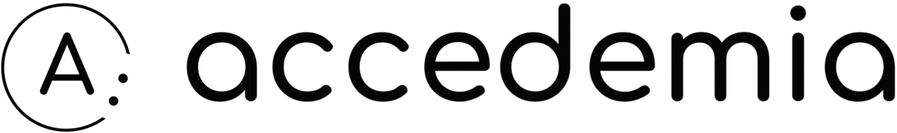

# Accedemia

<div align="center">
  
</div>

## Plataforma de Aprendizaje sobre Accesibilidad Web

Accedemia es una plataforma educativa interactiva diseñada para enseñar las Pautas de Accesibilidad para el Contenido Web (WCAG 2.2 - Nivel A) a través de ejercicios prácticos y con ayuda de inteligencia artificial. El proyecto forma parte de un proyecto de investigación sobre como mejorar la comprensión y aplicación de las pautas de accesibilidad en estudiantes y desarrolladores de programación web.

## Instalación

1. Clonar el repositorio:

   ```bash
   git clone https://github.com/yourusername/accedemia.git
   cd accedemia
   ```

2. Instalar dependencias:

   ```bash
   npm install
   ```

3. Configurar variables de entorno:
   - Crea un archivo .env.local con el siguiente contenido:

   ```text
   GOOGLE_API_KEY=tu_clave_api_de_gemini
   ```

4. Inicializar los submódulos de git:
   ```bash
   git submodule init
   git submodule update
   ```

5. Iniciar el servidor de desarrollo:

   ```bash
   npm run dev
   ```

6. Abrir [http://localhost:3000](http://localhost:3000) en tu navegador

## Licencia

Este proyecto está licenciado bajo AGPL-3.0 - consulta el archivo LICENSE para más detalles.
